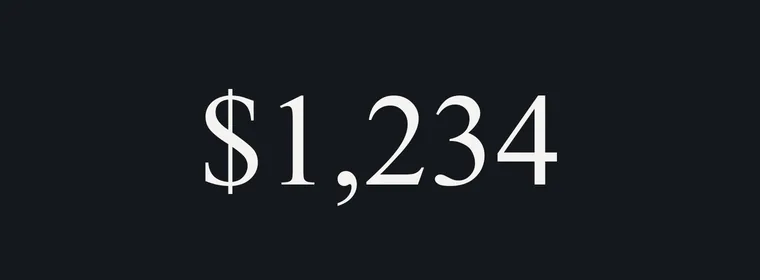

# sloteffect

> **Slot-machine-style rolls** for numbers, letters, and text in
> React. Each digit or character is its own reel that rolls **up or down** to its
> new value, wrapping through the charset, with a springy settle.

- **Dependency-free** — React is the only peer dependency (Web Animations API + a
  precomputed CSS `linear()` spring; no animation library, no JS spring loop).
- **Three components** — [`SlotNumber`](#slotnumber), [`SlotLetter`](#slotletter),
  [`SlotText`](#slottext).
- **Directional** — `direction="both"` (random per reel, default), `"up"`, or `"down"`.
- **Lean at rest** — a character is a single glyph until it changes; the rolling
  strip is built only for the duration of a transition, then removed. Unchanged
  cells never animate, so a hero number costs a handful of DOM nodes, not hundreds.
- **Any text, any direction** — `SlotText` segments by grapheme (emoji, combining
  marks, surrogate pairs stay intact), keeps natural spacing/kerning, and orders
  LTR or RTL automatically.
- **Accessible** — the value is the `aria-label`; reels are presentational;
  `prefers-reduced-motion` snaps instantly.
- **Tiny** — ~5 KB ESM, tree-shakeable, ships ESM + CJS + types.



**[▶ Live demo](https://jauderho.github.io/sloteffect/)**

---

## Install

```sh
bun add sloteffect       # or: npm i sloteffect / pnpm add sloteffect / yarn add sloteffect
```

React 18 or 19 is a peer dependency.

## Quick start

```tsx
import { SlotNumber, SlotLetter, SlotText } from "sloteffect";

// Currency / percent / compact — anything Intl.NumberFormat can format
<SlotNumber value={total} format={{ style: "currency", currency: "USD", maximumFractionDigits: 0 }} />

// A single rolling character
<SlotLetter char={grade} />

// An arbitrary string: letters and digits roll, the rest stays put
<SlotText text="JACKPOT 7" />
```

Place a component inside a styled element — it inherits `font-family`,
`font-size`, and `color` from the parent.

---

## Components

### `SlotNumber`

Formats a value with `Intl.NumberFormat` (plus an optional suffix) and rolls the
digits. Separators, currency symbols, and the suffix stay static. Accepts any
number (decimals, negatives, `NaN`/`Infinity`), a `bigint`, or an
already-formatted `string` (passed through verbatim).

```tsx
<SlotNumber value={0.813} format={{ style: "percent", minimumFractionDigits: 1 }} />   // 81.3%
<SlotNumber value={1234.5} format={{ style: "currency", currency: "USD" }} cents counter />  // $1,234.⁵⁰
<SlotNumber value={9007199254740993n} />                                               // bigint
```

| Prop | Type | Default | Description |
|---|---|---|---|
| `value` | `number \| bigint \| string` | — | Number/bigint to format, or a preformatted string. |
| `format` | `Intl.NumberFormatOptions` | — | Style, currency, fraction digits, etc. |
| `locales` | `string \| string[]` | `"en-US"` | BCP 47 locale(s). |
| `suffix` | `string` | `""` | Static text appended after the number (e.g. `"/yr"`). |
| `direction` | `"both" \| "up" \| "down"` | `"both"` | Roll direction. |
| `randomSpin` | `boolean` | `false` | Stagger each digit's spin/settle randomly per play. |
| `cents` | `boolean` | `false` | Render the two fractional digits at 90% size, bottom-aligned (the decimal point stays full size). Forces two fraction digits. |
| `counter` | `boolean` | `false` | Roll the digits like a gear-reduction odometer: each rolls from the **previous** value by however many of its own place-steps the value crossed, so low digits blur while the ten-thousands and up barely move. Best for a value that changes continuously (e.g. a slider); pass a stable `format` reference. |
| `className` / `style` | — | — | Passed to the container. |

`cents` and `counter` read the value's digit places via `Intl.NumberFormat.formatToParts`; they're skipped when `value` is a preformatted string.

### `SlotLetter`

A single character rolling through its case's alphabet (`A–Z` or `a–z`), wrapping
around. Non-letters render static.

```tsx
<SlotLetter char="Q" direction="up" />
```

| Prop | Type | Default | Description |
|---|---|---|---|
| `char` | `string` | — | The character to display. |
| `direction` | `"both" \| "up" \| "down"` | `"both"` | Roll direction. |
| `className` / `style` | — | — | Passed to the container. |

### `SlotText`

Animates any string in any script. The text is split into grapheme clusters, and
each cluster is a slot cell: digits and same-case Latin letters roll through their
charset, while every other glyph (other scripts, emoji, punctuation) flips cleanly
to its new value. At rest each cell is normal text, so spacing, kerning, and
LTR/RTL ordering are correct; cells are right-anchored so trailing positions keep
rolling as the string grows or shrinks.

```tsx
<SlotText text="Level 12" direction="down" />
<SlotText text="東京タワー" />          // CJK
<SlotText text="שלום עולם" />          // right-to-left, auto-detected
```

| Prop | Type | Default | Description |
|---|---|---|---|
| `text` | `string \| number \| bigint` | — | The string to display. |
| `direction` | `"both" \| "up" \| "down"` | `"both"` | Roll direction. |
| `dir` | `"auto" \| "ltr" \| "rtl"` | `"auto"` | Writing direction; `auto` infers it from the content. |
| `className` / `style` | — | — | Passed to the container. |

> **Note on connected scripts.** Because each grapheme animates in its own cell,
> scripts with contextual joining (e.g. Arabic) render in isolated forms while
> rolling. Latin, CJK, Hebrew, emoji, and digits are unaffected.

---

## Direction

Every component accepts `direction`:

| Value | Behavior |
|---|---|
| `"both"` *(default)* | Each reel flips a coin — up or down — independently. |
| `"up"` | All reels roll upward (charset index increases), wrapping. |
| `"down"` | All reels roll downward, wrapping. |

---

## Integration notes

- **Use `tabular-nums`.** Set `font-variant-numeric: tabular-nums` on the parent
  so digits keep an identical width and the layout doesn't shiver.
- **Line-height lives outside.** Reel cells are exactly `1em` tall; give the
  parent `line-height ≥ 1.15` (serif faces especially) so nothing clips.
- **Reserve it for hero numbers.** Animate key stats and answer-numbers — not
  tables, axis ticks, or tooltips that re-render wholesale.
- **Reduced motion.** Under `prefers-reduced-motion: reduce` the reels snap to the
  final value with no animation. (Headless/preview browsers often report reduced
  motion — stub `matchMedia` to observe the roll in tests.)
- **Ordered vs. flip.** Latin `0–9` / `A–Z` / `a–z` roll *through* their charset
  (the authentic reel). Any other glyph pair (other scripts, emoji, cross-charset)
  flips directly from old to new. For non-Latin numerals that should roll like
  digits, format with the `nu-latn` numbering system.

---

## Development

```sh
bun install
bun run typecheck   # tsc --noEmit (strict)
bun run lint        # biome check
bun run test        # vitest (direction/wraparound logic)
bun run build       # tsup → dist/ (ESM + CJS + .d.ts)
```

The showcase ([`index.html`](index.html)) is a single, build-free file deployed to
GitHub Pages by [`.github/workflows/pages.yml`](.github/workflows/pages.yml).

## License

[MIT](LICENSE) © Jauder Ho
